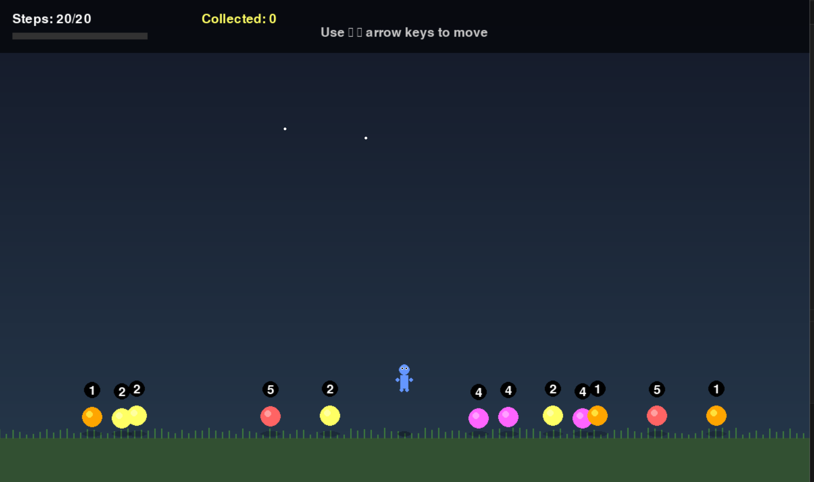

# 🍎 Fruit Harvest Adventure 🍊

A visually stunning puzzle-strategy game where you collect fruits optimally within a limited number of steps. Built with Python and Pygame, featuring smooth animations, particle effects, and engaging gameplay.

### Gameplay


## 🎮 Game Overview

In Fruit Harvest Adventure, you play as a character who needs to collect fruits scattered across a field. Each fruit has a different value, and you have a limited number of steps to maximize your harvest. The challenge is to find the optimal path that collects the most valuable fruits within your step limit.

### 🎯 Objective
- Collect as many fruit points as possible
- You have exactly 20 steps to move around
- Each fruit has a value from 1-5 points
- Achieve the maximum possible score to win!

## 🚀 Features

### Visual Enhancements
- **Beautiful Graphics**: Gradient backgrounds, realistic shadows, and colorful fruits
- **Smooth Animations**: 60 FPS gameplay with bouncing characters and fruits
- **Particle Effects**: Colorful particle bursts when collecting fruits
- **Camera Shake**: Dynamic feedback for movement and collection
- **Floating Text**: Visual feedback showing points gained

### Gameplay Features
- **Strategic Movement**: Plan your route carefully to maximize points
- **Real-time Feedback**: See your progress with a visual step counter
- **Perfect Score Challenge**: Algorithm calculates the theoretical maximum score
- **Restart System**: Play again instantly to improve your strategy

### Technical Features
- **Optimized Algorithm**: Uses binary search and sliding window for efficient calculation
- **Object-Oriented Design**: Clean, maintainable code structure
- **Particle System**: Physics-based particle effects with gravity
- **Animation System**: Smooth interpolation and timing systems

## 🛠️ Requirements

- Python 3.7 or higher
- Pygame library

## 📦 Installation

1. **Clone or download** the game files
2. **Install Pygame** if you haven't already:
   ```bash
   pip install pygame
   ```
3. **Run the game**:
   ```bash
    python 2106maxfruits.py
   ```

## 🎮 How to Play

### Controls
- **←** (Left Arrow): Move left
- **→** (Right Arrow): Move right
- **R**: Restart game (when game is over)
- **ESC**: Quit game

### Gameplay Tips
1. **Plan Ahead**: Look at all fruit values before moving
2. **Optimize Your Path**: You can move back and forth - find the most efficient route
3. **Consider Distance**: Moving to distant fruits costs more steps
4. **Perfect Strategy**: The game uses an algorithm to calculate the maximum possible score

### Winning
- Collect fruits equal to the maximum possible score to achieve a **Perfect Harvest**
- The algorithm considers optimal movement patterns including:
  - Going left first, then right
  - Going right first, then left
  - The most efficient path for your step limit

## 🧮 Algorithm Details

The game implements an advanced optimization algorithm that:

1. **Calculates Maximum Possible Score**: Uses binary search and sliding window technique
2. **Considers All Strategies**: Evaluates both left-first and right-first approaches
3. **Optimizes Movement**: Accounts for the most efficient path within step constraints
4. **Real-time Comparison**: Shows your performance against the theoretical maximum

### Algorithm Complexity
- **Time Complexity**: O(n log n) where n is the number of fruits
- **Space Complexity**: O(n) for storing positions and prefix sums

## 🎨 Customization

### Easy Modifications
You can easily customize the game by modifying these variables in the `FruitHarvestGame` class:

```python
# Game Configuration
self.NUM_POSITIONS = 50    # Size of the playing field
self.k = 20               # Number of steps allowed
self.FRUIT_RADIUS = 15    # Size of fruits
self.SCREEN_WIDTH = 1200  # Window width
self.SCREEN_HEIGHT = 800  # Window height

# Colors
self.FRUIT_COLORS = [
    (255, 100, 100),  # Red apple
    (255, 165, 0),    # Orange
    (255, 255, 100),  # Banana
    (128, 255, 128),  # Green apple
    (255, 100, 255),  # Purple grape
]
```

### Advanced Customization
- **Add New Fruit Types**: Extend the `FRUIT_COLORS` array
- **Modify Particle Effects**: Adjust particle count and physics in `add_particles()`
- **Change Animation Speed**: Modify bounce rates and animation timers
- **Add Sound Effects**: Integrate pygame.mixer for audio feedback

## 🏗️ Code Structure

```
FruitHarvestGame/
├── max_total_fruits()     # Core optimization algorithm
├── Particle class        # Particle effect system
├── FloatingText class    # Text animation system
└── FruitHarvestGame class # Main game engine
    ├── Visual Systems
    │   ├── draw_background()
    │   ├── draw_fruits()
    │   ├── draw_player()
    │   └── draw_effects()
    ├── Game Logic
    │   ├── handle_input()
    │   ├── check_game_end()
    │   └── reset_game()
    └── Animation Systems
        ├── update_effects()
        └── Various animation timers
```

## 🐛 Troubleshooting

### Common Issues

**Game runs slowly**
- Reduce `SCREEN_WIDTH` and `SCREEN_HEIGHT`
- Lower the FPS in `self.clock.tick(60)` to `self.clock.tick(30)`

**Fruits are hard to see**
- Increase `FRUIT_RADIUS`
- Modify colors in `FRUIT_COLORS` for better contrast

**Game window is too large**
- Adjust `SCREEN_WIDTH` and `SCREEN_HEIGHT` to fit your screen

### Performance Optimization
- The game is optimized for 60 FPS
- Particle effects automatically clean up to prevent memory leaks
- All animations use efficient mathematical functions

## 🎯 Game Strategies

### Beginner Tips
- Start by collecting nearby high-value fruits
- Don't waste steps on low-value distant fruits
- Remember you can change direction

### Advanced Strategies
- Calculate the "fruit density" in different areas
- Consider the cost of movement vs. fruit value
- Use the restart feature to experiment with different approaches

### Perfect Score Tips
- The algorithm considers all possible optimal paths
- Sometimes going in the "wrong" direction first is optimal
- Practice with different random fruit layouts to improve

## 🤝 Contributing

Feel free to enhance the game! Some ideas:
- Add power-ups or special fruits
- Implement different difficulty levels
- Add sound effects and music
- Create different terrain types
- Add multiplayer support

## 📜 License

This project is open source. Feel free to use, modify, and distribute as needed.

## 🎉 Credits

- **Algorithm**: Advanced optimization using binary search and sliding window
- **Graphics**: Custom Pygame implementation with modern visual effects
- **Game Design**: Strategic puzzle gameplay with perfect score challenges

---

**Enjoy your fruit harvesting adventure! 🍎🍊🍌**

*Can you achieve the perfect harvest?*